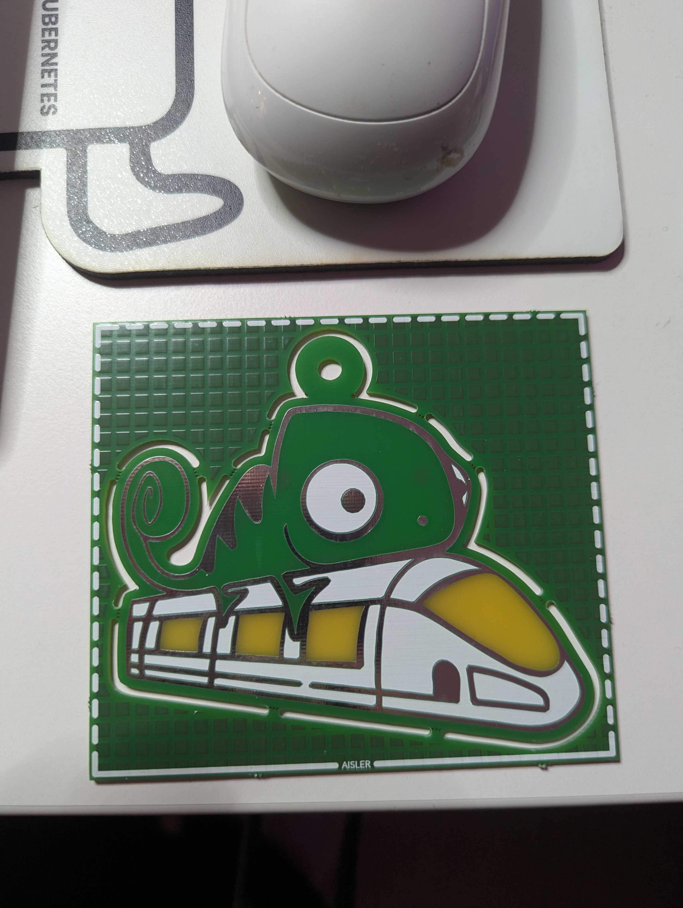
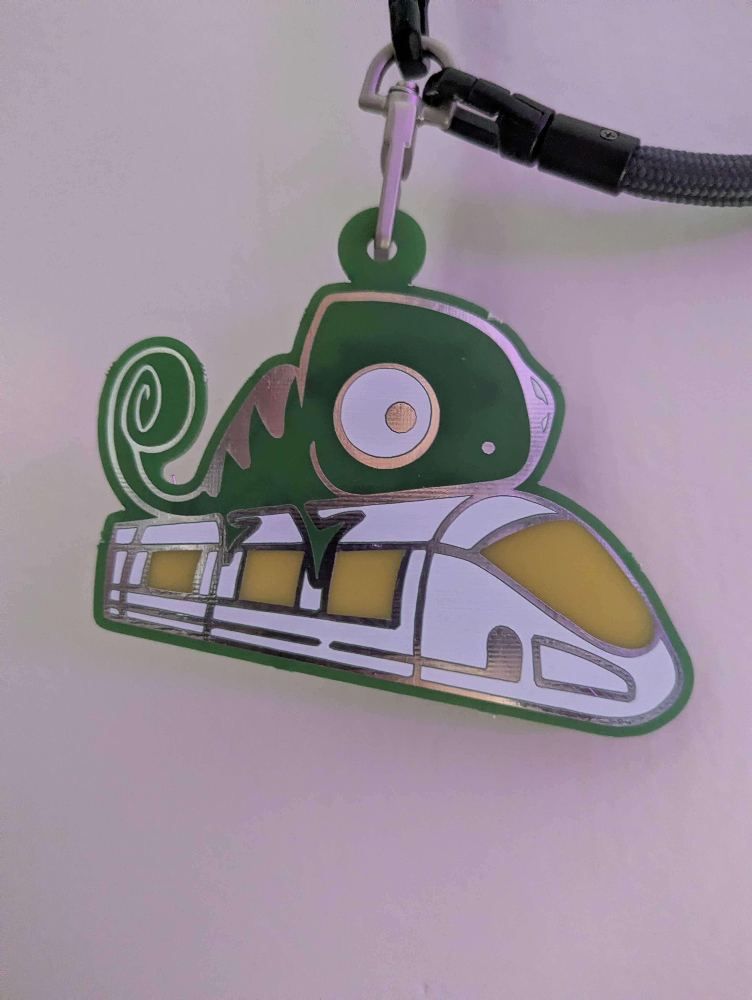
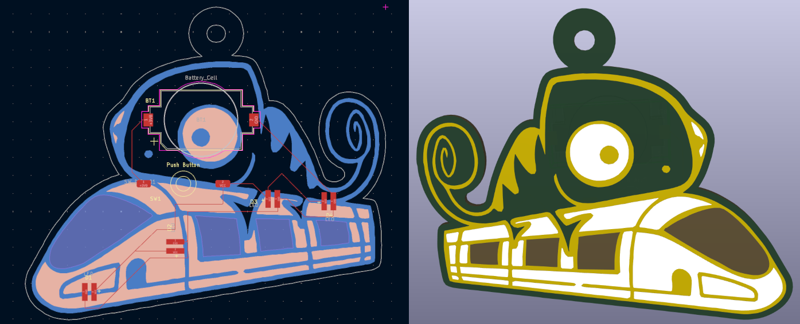
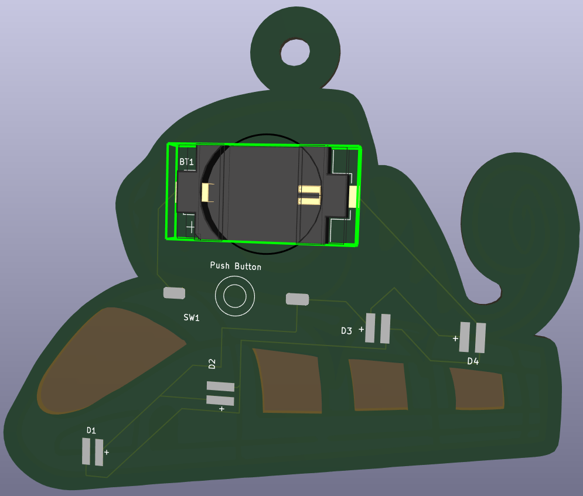

# HackweekGeekoPCB

PCB of the Hackweek "Train of thought" Logo that blinks

The windows of the train have the copper layer and the mask removed, so the LEDs
will shine from behind the windows and make a blinking party train.

The loop above the head of the Geeko is a hanger so you can clip it onto your regular conference badges.

Link to Hackweek 2025 project:

https://hackweek.opensuse.org/25/projects/the-led-geeko-develop-a-diy-kit-for-a-wearable-led-geeko-badge

  
  
  

## BOM

- 4x RGB ~3V LEDs with inbuilt limiting resistor
- 1x SMD Button
- 1x CR2032 Battery Holder (SMD)
- 1x CR2032 Battery

## References

- I used the repository by blinkyparts as reference and also used their footprint library: https://github.com/blinkyparts/unicorn
- The Hackweek logo was edited to work for svg2mod and is taken from: https://hackweek.opensuse.org/img/HW24/

## Pictures

